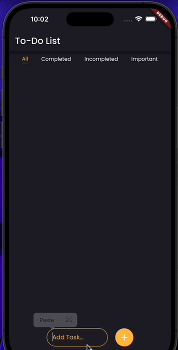
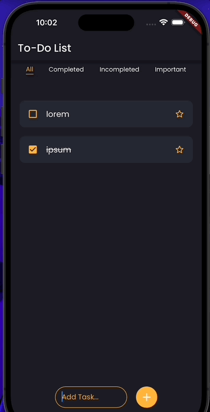
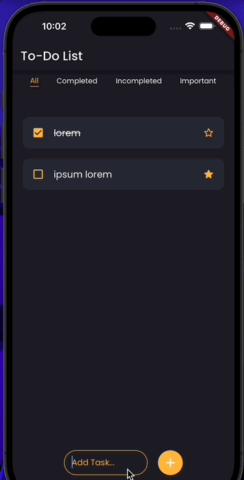

# To-Do List App - KangmoonSeo
To-Do List App using Flutter

---
## Day 1

### 구현 내용

- 기본 UI 설계 
- To-do 추가 

--- 
- 현재 HomeScreen이 AddTodo와 TodoList를 자식으로 가지고 있는 상황입니다.
-  이때 AddTodo Widget에서 변경한 데이터를 TodoList Widget로 넘기기 위해 두 가지 방법을 고려하고 있습니다. 
    1. 상태 관리 라이브러리를 사용 (GetX 등)
    2. HomeScreen을 Stateful로 만들어 HomeScreen build 관련 메서드를 AddTodo에게 전달
- Day 2 에서 두 방법 중 하나를 선택해 기능을 완성하겠습니다.

---
## Day 2

이미지 접기/펼치기

### To-Do 생성 UI 개선

### Important 토글

### Completed 토글

## 텍스트 수정

## To-Do 삭제

### 구현 내용

- 상태 관리 문제 해결 
    - AddTodo 위젯 -> 메서드화, HomeScreen 위젯과 통합
    - `List<int> todoList`, `List<TodoModel> todoRepository` 이분화
        - todoRepository에서 각각의 TodoModel을 저장
        - 리스트를 다룰 때에는 todoList 
- 삭제 기능
    - end-to-start로 Todo를 밀면 Todo가 삭제됩니다. 
- Important toggle 
- Completed toggle
    - 체크박스와 텍스트를 `tap`하면 toggle 됩니다.
- Text Edit
    - 텍스트를 `longPress`하면 텍스트 수정 창이 팝업됩니다.
    - 팝업 창에 수정할 텍스트를 입력한 후 우측하단 버튼을 누르면 텍스트가 수정됩니다. 

## Day 3

### 구현 내용
- `TabBarView`로 To-Do 상태에 따른 페이지 분리
- 리팩터링
    - Scaffold 구조 개선
        - appbar, body, bottomNavigationBar로 나누어 구현
            - appbar: Appbar (bottom: tabBar)
            - body: TabBarView
            - bottomNavigationBar: addTaskWidget
    - `prefs` StorageService class로 분리
        - todoRepository, todoList도 StorageService로 옮겨 관리할 예정입니다.

## Day 4

### 구현 내용
- 리팩터링
    - localStorage 관리 부분 `StorageService`로 완전 분리
    - AddTask 위젯 분리
    - StorageService 메서드 로그 추가
- 버그 수정
    - 앱 첫 진입 시 데이터가 로딩되지 않는 문제
        - `initApp` 비동기 데이터 초기화 이후 `.then()`으로 화면 렌더링 호출
    - Important, Completed 속성 변경 시 간헐적으로 적용되지 않는 문제
        - `StorageService.store()` 호출하여 안정성 개선